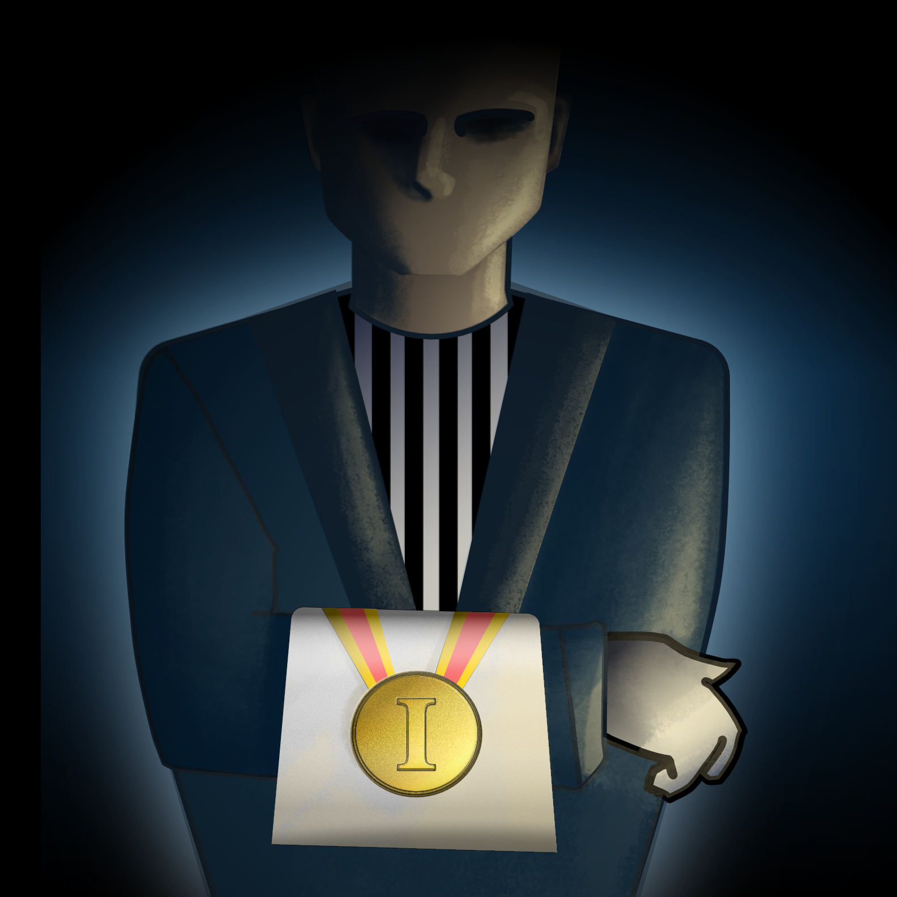

# Competitive table soccer ranking for Telegram chats

*It's rather easy for humans to compare two players in their capabilities, but ranking a group of players is a different beast altogether.*

This repository hosts a [Telegram](https://telegram.org/) bot implementation capable of continuous ranking of chat users on 1-1 and 2-2 table soccer games. Both gametypes contribute to the same ranking, and underlying ranking-algorithm is [Trueskill](https://www.microsoft.com/en-us/research/project/trueskill-ranking-system/) (chosen for it's sane support for multiplayer matches).

## Running the bot

<figure>

<figcaption>Figure by <a href="https://www.instagram.com/loviisakataja/">Loviisa Kataja</a></figcaption>
</figure>

For the bot to be able to respond on Telegram, this code needs to be **running** on an internet connected computer (e.g. Raspberry Pi is sufficient).

The codebase requires Python 3 to be installed. The dependencies of the codebase can be installed with the following:

```
pip3 install -r requirements.txt
```

Furthermore, for you to be the master of the bot, you need to **create a new bot in Telegram**. This can be done by contacting [@Botfather](https://t.me/botfather) in Telegram and following [these steps](https://core.telegram.org/bots#6-botfather). After creating the bot, the botfather will provide you with bot-token (e.g. `110201543:AAHdqTcvCH1vGWJxfSeofSAs0K5PALDsaw`) which you should add to your computer's environmental variables. Alternatively you can include it to `tg_bot.py` file, but be careful not to commit the token to Github.

Run the bot with the following command:

```
python3 tg_bot.py
```

## Bot usage

After the bot is running, you can start a ranking with the following steps:

1. [OPTIONAL] Start a new Telegram group for the ranking
2. Invite the bot into the telegram group
3. Post the bot-command `\start@YOUR_BOT_NICKNAME` in the chat
    * Requires you to be the admin of the group

The bot has following commands available:

* `\singles @[OPPONENT_NICKNAME] [SUBMITTER_SCORE] [OPPONENT_SCORE]` Record a 1-1 match result between the submitter and the opponent.
* `\duals @[TEAMMATE_NICNAME] @[OPPONENT_1_NICKNAME] @[OPPONENT_2_NICKNAME] [SUBMITTER_SCORE] [OPPONENT_SCORE]` Record a 2-2 match results between the submitter's team and the opponent team. Both teammembers are attributed equal contribution for the result.
* `\board` Bot will respond with the ranking leaderboard.
* `\help` Bot will respond with list of available bot-commands.
